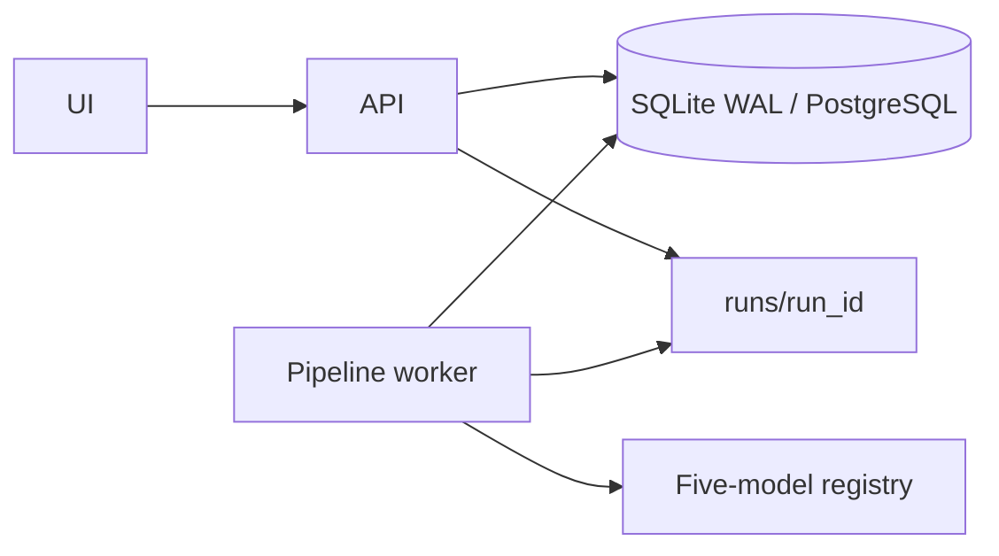

# Production stabilization architecture

## Runtime shape

The API persists a `PipelineRun`, returns its `run_id`, and places durable queue
metadata in the database. An independent worker claims queued work, renews a
lease heartbeat, executes resumable steps, and writes structured artifacts.



Every run directory contains `request.json`, `manifest.json`, `logs.jsonl`,
`worker.json`, `steps/`, and `artifacts/`. File downloads resolve their real
path and verify containment below that run root.

## Five-model status

`GET /api/v1/models/production/status` exposes exactly PepMLM, PepPrCLIP,
EvoBind2, PepHAR, and PepFlow. Probes derive state from configured runtime,
Python environment, checkpoint, and busy marker. A registered entry is never
presented as a completed inference. Configure paths with the variables in
`.env.example`; model weights remain outside Git.

## Operations

```bash
# Database (Alembic is the formal migration mechanism)
cd backend && alembic upgrade head

# API and durable worker (run under systemd/supervisor in production)
python -m uvicorn app.main:app --host 0.0.0.0 --port "${STAMP_PORT:-8000}"
python -m app.workers.pipeline_worker --loop

# One bounded worker cycle for diagnostics
python -m app.workers.pipeline_worker --once
```

Use PostgreSQL for multi-host production. For single-host SQLite, WAL,
foreign-key enforcement, and a 30-second busy timeout are configured. Keep API
and worker processes under a process manager with restart-on-failure and send
stdout/stderr to journald or another rotating log collector.

## Failure recovery

1. Check the run's `manifest.json`, `worker.json`, and `logs.jsonl`.
2. A worker lease that expires changes a running job to interrupted and queues
   it again. Completed steps retain state and are skipped on resumption.
3. Retry from an explicit step through the retry API. Delivery is idempotent.
4. Cancellation is cooperative: queued jobs stop immediately and active jobs
   stop at the next step boundary.
5. After schema trouble, stop writers, back up the database, run
   `alembic downgrade <previous_revision>`, then restart API and worker.

## Retention

Archive run manifests and scientific outputs according to the study policy.
Delete expired run directories only after the matching database record is
terminal and the audit archive has been verified. Never serve an arbitrary
client-provided filesystem path.
